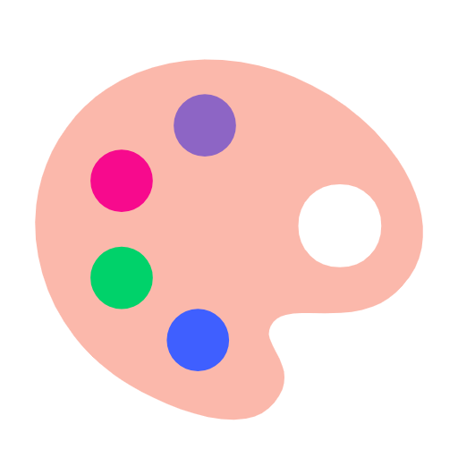

# stylecn

> Brand-themed presets for [shadcn/ui](https://ui.shadcn.com).

A gallery of real-world brand designs — Apple, Stripe, Linear, Airbnb, and more — applied to the full shadcn/ui component set. Browse the live preview, pick the brand you like, copy the CSS variables. Drop them into your own shadcn project.

**Live preview:** <https://daniakash.github.io/stylecn/>

## Why

shadcn/ui ships a neutral baseline. Most teams then spend hours tweaking CSS variables to match their own brand. `stylecn` does the work for a few well-known brands so you can copy and ship.

## Available brands

14 brand presets ship today, plus the neutral shadcn baseline. Sorted alphabetically.

| Brand | Primary CTA | Surface treatment | Card radius |
|---|---|---|---|
| Airbnb | `#ff385c` Rausch coral | White cards on Fog `#f7f7f7` canvas | 20px |
| Apple | `#0071e3` Azure | White cards lifted off Fog `#f5f5f7` canvas | 28px |
| Claude | `#d97757` Warm orange | Parchment `#faf9f5`, flat (card == canvas) | 10px |
| Cursor | `#f54e00` Onyx orange | Pebble-gray `#e6e5e0` cards on warm parchment canvas | 4px |
| Duolingo | `#58cc02` Vivid green | White, rounded everywhere, Nunito sans | 12px |
| ElevenLabs | `#000000` Obsidian | White cards on Eggshell `#fdfcfc` canvas | 16px |
| Fly.io | `#7c3aed` Electric violet | White cards floating on Lavender Mist sidebar | 16px |
| Linear | `#5e6ad2` Brand violet | Dark-first command center; light mode inverts cleanly | 6px |
| Raycast | `#ff6363` Coral | Dark-first obsidian terminal; light mode inverts | 11px |
| Resend | `#3b9eff` Sky blue | Dark-first developer terminal; serif heading fallback | 16px |
| Stripe | `#533afd` Deep violet | Powder-blue tinted cards on pure white | 6px |
| Superhuman | `#714cb6` Violet | White cards on cream `#f2f0eb` canvas | 16px |
| Todoist | `#e34432` Soft red | Warm-white `#fefdfc` flat surfaces | 10px |
| Wise | `#9fe870` Lime green | White, lime CTA with dark text (inverted foreground) | 10px |

Three brands ship **dark-first** — their canonical mode is dark and a coherent light variant is provided alongside.

More coming — see [Adding a brand](#adding-a-brand).

## Use a theme in your project

Two ways, pick the one that fits.

### 1. shadcn CLI (recommended)

Each brand is a shadcn GitHub registry item. Install any brand straight into your shadcn project:

```sh
bunx --bun shadcn@latest add DaniAkash/stylecn/airbnb   # bun
pnpm dlx shadcn@latest add DaniAkash/stylecn/airbnb     # pnpm
npx shadcn@latest add DaniAkash/stylecn/airbnb          # npm
```

Replace `airbnb` with any brand id: `airbnb`, `apple`, `claude`, `cursor`, `duolingo`, `elevenlabs`, `fly`, `linear`, `raycast`, `resend`, `stripe`, `superhuman`, `todoist`, `wise`.

The CLI merges the brand's CSS variables into your project's `globals.css`, npm-installs any font dependencies, and prints any usage notes. Restart `dev` and your shadcn app wears the brand.

Pin to a release tag for stability:

```sh
bunx --bun shadcn@latest add DaniAkash/stylecn/airbnb#v1.0.0
```

Requirements: a shadcn project on Tailwind v4 with a `components.json` at the root.

### 2. Copy & paste

Visit the [live preview](https://daniakash.github.io/stylecn/), pick a brand, click **Copy CSS**. Paste the block into your project's `index.css` (or `globals.css`). Done.

## Local development

```sh
bun install
bun dev      # http://localhost:5173
```

The picker lives at `/`. URL contract: `?brand=<id>` swaps the active brand without a reload.

## Adding a brand

1. Define the brand's design system as a token spec (colors, radii, typography stack, surface levels).
2. Add a new `BrandTokens` entry to `src/themes/brand-tokens.ts` — that file is the single source of truth.
3. Run `bun run themes:build` to regenerate `src/themes/brands.css`, `registry.json`, and the Copy-CSS snippets map. Commit all three generated files alongside the token addition.
4. Attach a screenshot of the live preview in light + dark modes to the PR.

The token spec process itself (extracting real brand sites into a structured design brief) is intentionally not documented here — that's the maintainer's research workflow. Submit the derived tokens and we'll review.

## Stack

- Vite + React 19 + TypeScript
- Tailwind CSS v4
- shadcn/ui (radix base, nova style)
- bun

## License

MIT
